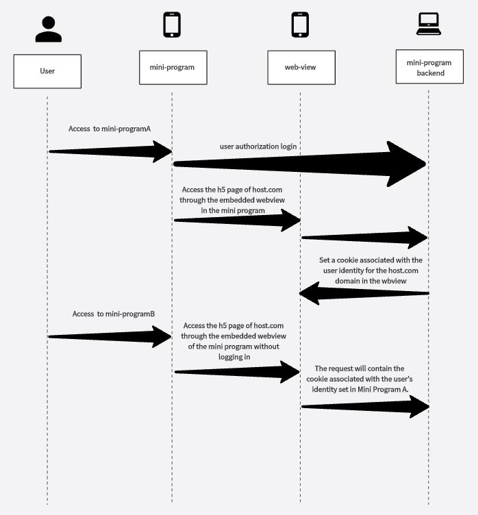

# Cookie Share In WebView
## Description
* In the mini program, data can be shared between the web-view and the mini-program through the specified interface.
* Therefore, when a certain mini program sends privacy to the H5 page embedded in the web-view component, and the privacy message is saved as a cookie by the H5 page, when other mini-programs also embed H5 under the same domain in the web-view. When the user enters H5 under the same domain in the web-view of other mini-programs, even if the user has not logged in, the data will be shared between the two mini-programs. the user's login status can also be obtained through cookies to track user behavior.

* At the same time, through the specified interface, the mini program can also obtain cookie messages from the H5 page in the web-view.
* As shown below
 

## Analysis
* We found that in WeChat, although there is an independent sandbox for each mini program and the internal data storage is independent of each other, this is not the case in the web view component. We found that cookies in web view are saved in a shared file, which is the Cookies.binarycookies file located in the '/Library/Cookies/' path in the WeChat directory. Cookies in different web view components of different mini programs are also saved in this file, resulting in a shared situation

## POC
* 

## Example

