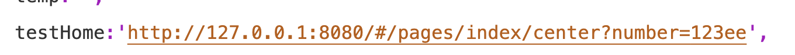
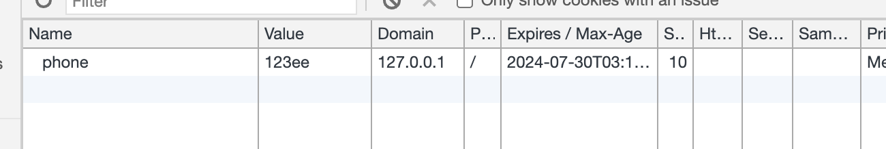
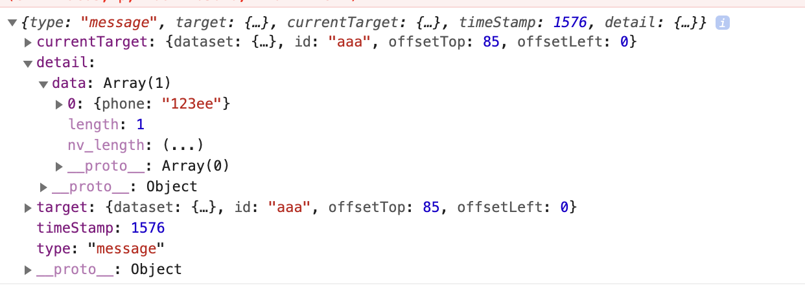
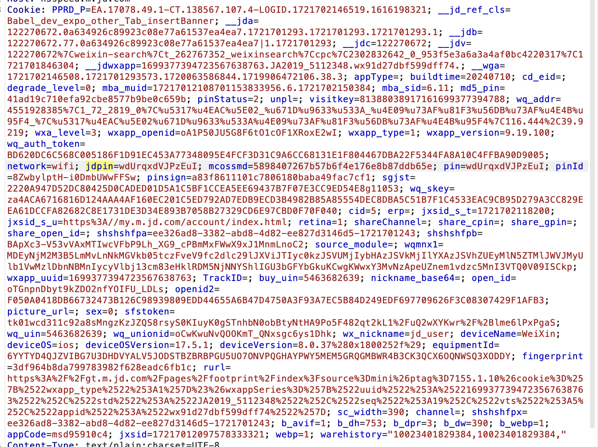
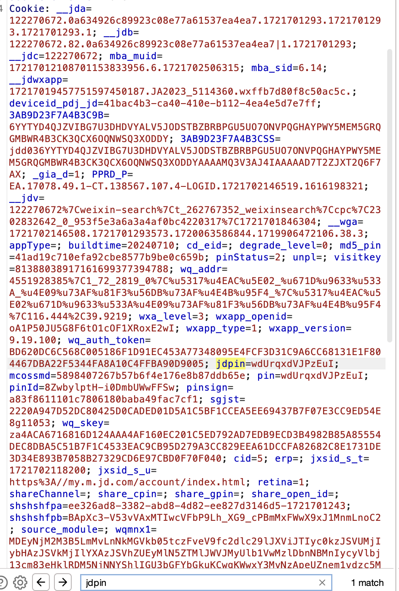

# Cookie Share In WebView
## Description
* In the mini program, data can be shared between the web-view and the mini-program through the specified interface.
* Therefore, when a certain mini program sends privacy to the H5 page embedded in the web-view component, and the privacy message is saved as a cookie by the H5 page, when other mini-programs also embed H5 under the same domain in the web-view. When the user enters H5 under the same domain in the web-view of other mini-programs, even if the user has not logged in, the data will be shared between the two mini-programs. the user's login status can also be obtained through cookies to track user behavior.

* At the same time, through the specified interface, the mini program can also obtain cookie messages from the H5 page in the web-view.
* As shown below
 

## Analysis
* We found that in WeChat, although there is an independent sandbox for each mini program and the internal data storage is independent of each other, this is not the case in the web view component. We found that cookies in web view are saved in a shared file, which is the Cookies.binarycookies file located in the '/Library/Cookies/' path in the WeChat directory. Cookies in different web view components of different mini programs are also saved in this file, resulting in a shared situation

## POC
* We designed the following experiment to demonstrate how cookies can be passed between pages within a mini-program and in a web-view
We choose to use URL concatenation to pass data into the web-view, and then save this data as a cookie. Using the functions provided by the web view component, we can pass the data from the web view to the mini program
    * The URL spliced together

    * Cookies saved in web-view

    * The data passed into the mini-program from the web-view

As analyzed above, cookies are not completely isolated between mini programs. Mini programs can use cookie sharing to share data without the user and the super app being aware, thus bypassing the authorization mechanism of the super app

## Example
* We have found a case of cookie sharing in the mini program ecosystem, as shown in the following figure
When we authorized login in the JD shopping mini program and entered the web view page of the current mini program while capturing packets, we found that there were jdpin and other cookie fields representing the username in the cookie
  

* However, when we enter the JD Home mini program and enter a certain web view page without logging in, we can find through packet capture that even without logging in, the mini program can still bypass the authorization process in the super app by using cookies in the web view component to obtain the user's username and other information from other mini programs
  

